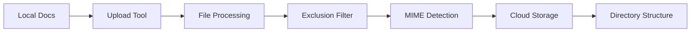
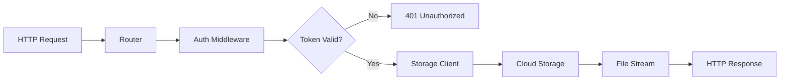
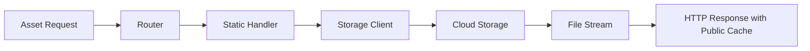

# Cloud Docs architecture

This document describes the architecture, components, and design decisions of the Cloud Docs serverless document hosting platform.

## Overview

Cloud Docs is a secure, serverless document hosting platform built on Google Cloud Platform. It provides token-based access control for private documents with a complete set of CLI tools for management and deployment.

## System architecture

```
┌─────────────────────────────────────────────────────────────────┐
│                        Cloud Docs System                       │
├─────────────────┬───────────────────────┬───────────────────────┤
│   Client Tools  │    Cloud Run Service  │   Google Cloud Storage│
│                 │                       │                       │
│ ┌─────────────┐ │ ┌───────────────────┐ │ ┌───────────────────┐ │
│ │Upload Tool  │ │ │                   │ │ │                   │ │
│ │             │ │ │   HTTP Server     │ │ │   Document Store  │ │
│ │ - Recursive │ │ │   (Chi Router)    │ │ │                   │ │
│ │   upload    │ │ │                   │ │ │ - HTML files      │ │
│ │ - Structure │ │ │ ┌───────────────┐ │ │ │ - CSS/JS assets   │ │
│ │   preserve  │ │ │ │ Auth Middleware│ │ │ │ - Images/PDFs     │ │
│ │ - Filtering │ │ │ │               │ │ │ │ - Directory tree  │ │
│ └─────────────┘ │ │ │ - Token       │ │ │ └───────────────────┘ │
│                 │ │ │   validation  │ │ │                       │
│ ┌─────────────┐ │ │ │ - Multiple    │ │ │                       │
│ │Token Tool   │ │ │ │   sources     │ │ │                       │
│ │             │ │ │ │ - Expiration  │ │ │                       │
│ │ - Generate  │ │ │ └───────────────┘ │ │                       │
│ │ - Validate  │ │ │                   │ │                       │
│ │ - HMAC-SHA256│ │ │ ┌───────────────┐ │ │                       │
│ └─────────────┘ │ │ │ Storage Client│ │ │                       │
│                 │ │ │               │ │ │                       │
│ ┌─────────────┐ │ │ │ - File serving│◄─┼─┤                       │
│ │Iframe Tool  │ │ │ │ - MIME types  │ │ │                       │
│ │             │ │ │ │ - Error handle│ │ │                       │
│ │ - URL build │ │ │ └───────────────┘ │ │                       │
│ │ - Attributes│ │ │                   │ │                       │
│ │ - Embedding │ │ └───────────────────┘ │                       │
│ └─────────────┘ │                       │                       │
└─────────────────┴───────────────────────┴───────────────────────┘
```

## Components

### 1. Cloud Run service

**Technology**: Go 1.24, Chi router v5, Alpine Linux container

**Responsibilities**:
- HTTP request handling and routing
- Two-tier authentication (token-protected documents, public static assets)
- Document serving from Google Cloud Storage
- Static asset serving (CSS, JavaScript, images)
- Health checks and monitoring
- Graceful shutdown handling

**Key features**:
- Serverless auto-scaling (0 to N instances)
- HTTPS termination and HTTP/2 support
- Request logging and tracing
- Non-root container execution for security

### 2. Google Cloud Storage

**Responsibilities**:
- Document and asset storage
- Directory structure preservation
- Content delivery with proper MIME types
- Access control integration

**Organization**:
```
bucket-name/
├── index.html              # Root documents
├── styles.css              
├── folder1/                # Subdirectories preserved
│   ├── doc.html           
│   └── assets/
└── uploads/                # Organized uploads
    └── v1.0/
```

### 3. CLI tools

#### Upload tool
- **Purpose**: Deploy documents to Cloud Storage
- **Features**: Recursive upload, exclusion patterns, progress reporting
- **Usage**: `./bin/upload -source ./docs -bucket my-bucket`

#### Token tool  
- **Purpose**: Generate and validate access tokens
- **Security**: HMAC-SHA256 signed JWT-like tokens
- **Usage**: `./bin/token -generate -expires 24h`

#### Iframe tool
- **Purpose**: Generate embeddable HTML with authenticated URLs
- **Features**: Custom attributes, token integration, URL encoding
- **Usage**: `./bin/iframe -document /path -base-url https://service-url`

## Security architecture

### Token-based authentication

**Token format**: `{base64-payload}.{base64-signature}`

**Payload structure**:
```json
{
  "id": "uuid-v4",
  "expires_at": "2025-08-10T19:35:46.982317Z", 
  "issued_at": "2025-08-09T19:35:46.982317Z"
}
```

**Security features**:
- HMAC-SHA256 signature verification
- Configurable expiration times
- Timing-safe signature comparison
- UUID-based request tracking

### Authentication flow

**For Documents** (HTML, sensitive content):
1. **Token Generation**: CLI tool generates signed token with expiration
2. **URL Construction**: Token included as query parameter or header
3. **Request Authentication**: Middleware validates signature and expiration
4. **Access Grant**: Valid tokens allow document access

**For Static Assets** (CSS, JavaScript, images):
1. **Direct Access**: No token required for `/docs/static/*` routes
2. **Public Serving**: Assets served with public caching headers
3. **Security Boundary**: Only non-sensitive styling/functionality assets

### Security boundaries

- **Public endpoints**: `/health`, `/`, `/ping` (no auth required)
- **Public static assets**: `/docs/static/*` (no auth required, non-sensitive content)
- **Protected documents**: `/docs/*` (token required, sensitive content)
- **Token sources**: Query param, Authorization header, or cookie
- **Error handling**: Generic messages, no information leakage

## Data flow

### Document upload workflow



1. Upload tool scans local directory recursively
1. Files filtered by exclusion patterns (`.git/*`, `*.tmp`, etc.)
1. MIME types detected based on file extensions
1. Files uploaded to Cloud Storage preserving directory structure
1. Progress reporting and error handling throughout

### Document serving workflow



1. Client requests document with token
1. Chi router matches `/docs/*` pattern
1. Auth middleware extracts and validates token
1. Storage client fetches file from Cloud Storage
1. File streamed to client with proper headers

### Static asset serving workflow



1. Client requests static asset (CSS/JS/image) without token
1. Chi router matches `/docs/static/*` pattern
1. Static handler directly fetches from Cloud Storage
1. File streamed with public caching headers for performance

## Deployment architecture

### Container build process

**Multi-stage Dockerfile**:
1. **Builder stage**: Go 1.24 Alpine, compile all binaries
1. **Runtime stage**: Minimal Alpine, copy binaries, security hardening

**Security hardening**:
- Non-root user (appuser:1001)
- Minimal base image (Alpine Linux)
- No shell or unnecessary tools
- Health check endpoint

### Cloud Build pipeline

**Build steps**:
1. **Build**: Docker build with multi-stage optimization
1. **Push**: Container image to Google Container Registry  
1. **Deploy**: Cloud Run service with environment configuration

**Configuration**:
- Automatic scaling (0-1000 instances)
- 512MB memory, 1 vCPU per instance
- 80 concurrent requests per instance
- Environment-based configuration

## Configuration management

### Environment variables

| Variable | Purpose | Default | Example |
|----------|---------|---------|---------|
| `PORT` | HTTP server port | `8080` | `8080` |
| `BUCKET_NAME` | GCS bucket name | Required | `docs-bucket-prod` |
| `TOKEN_SECRET` | HMAC signing key | Required | `base64-encoded-secret` |
| `DOCS_PATH` | URL path prefix | `/docs` | `/documents` |
| `LOG_LEVEL` | Logging verbosity | `info` | `debug` |

### Configuration sources
1. **Environment variables** (runtime)
1. **Cloud Run service configuration** (deployment)
1. **CLI flags** (tools)
1. **Default values** (fallback)

## Monitoring and observability

### Health checks
- **Endpoint**: `/health` returns JSON with timestamp
- **Container**: Docker HEALTHCHECK with wget
- **Cloud Run**: Built-in health monitoring

### Logging
- **Request logging**: Chi middleware with request IDs
- **Application logs**: Structured logging to Cloud Logging
- **Error tracking**: Cloud Error Reporting integration

### Metrics
- **Cloud Run metrics**: Request count, latency, error rate
- **Custom metrics**: Token usage, file access patterns
- **Alerting**: Cloud Monitoring alerts on errors/latency

## Performance characteristics

### Response times
- **Health check**: < 10ms
- **Document serving**: < 100ms (cached), < 500ms (cold start)
- **Token validation**: < 5ms (in-memory operation)

### Scalability
- **Auto-scaling**: 0 to 1000 instances based on traffic
- **Cold starts**: ~2-3 seconds for new instances
- **Concurrent requests**: 80 per instance, 80,000 total capacity

### Caching
- **Browser caching**: Proper HTTP cache headers
- **CDN integration**: Ready for Cloud CDN
- **Instance caching**: In-memory token validation

## Development workflow

### Local development
1. **Build**: `go build ./cmd/server`
1. **Test**: `go test ./...`
1. **Container**: `./scripts/build-local.sh project-id`
1. **Run**: `podman run -p 8080:8080 -e BUCKET_NAME=bucket cloud-docs-server`

### Production deployment
1. **Upload docs**: `./bin/upload -source docs -bucket prod-bucket`
1. **Deploy service**: `./scripts/deploy.sh project bucket secret`
1. **Generate tokens**: `./bin/token -generate -expires 24h`
1. **Create iframes**: `./bin/iframe -document /path -base-url https://service`

## Design decisions

### Why serverless?
- **Cost efficiency**: Pay only for actual usage
- **Automatic scaling**: Handle traffic spikes without intervention  
- **Maintenance-free**: No server management or patching
- **Global deployment**: Multi-region availability

### Why token-based auth?
- **Stateless**: No session storage or database required
- **Flexible**: Configurable expiration and embedding
- **Secure**: Cryptographic signatures prevent tampering
- **Simple**: Easy to integrate with any client application

### Why Go?
- **Performance**: Fast startup times for serverless
- **Simplicity**: Easy deployment and maintenance
- **Standard library**: Rich HTTP and crypto support
- **Containers**: Excellent Docker/container support

### Why Chi router?
- **Lightweight**: Minimal overhead and fast routing
- **Standard library compatible**: Uses net/http patterns
- **Middleware rich**: Built-in and custom middleware support
- **Modern**: Active development and HTTP/2 ready

## Security considerations

### Threat model
- **Unauthorized access**: Mitigated by token authentication
- **Token theft**: Mitigated by short expiration times
- **Container compromise**: Mitigated by non-root execution
- **Data exposure**: Mitigated by private bucket + authentication

### Security controls
- **Authentication**: Required for all document access
- **Authorization**: Token-based access control
- **Transport security**: HTTPS/TLS 1.3 by default
- **Container security**: Non-root, minimal attack surface
- **Input validation**: All user inputs validated and sanitized

### Compliance considerations
- **Data residency**: Single-region deployment available
- **Audit logging**: All access logged to Cloud Logging
- **Encryption**: Data encrypted at rest and in transit
- **Access controls**: IAM integration for administrative access